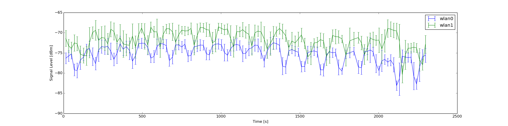

# Wifi-Signal-Plotter
Simple example Python script for comparing Wifi Signal strength between Wifi adaptors in Linux or Windows

Tested on Python 3.4/3.5

Requirements:
  - subprocess module
  - numpy and matplotlib libraries
